# Sales Order API — Spring Boot and JPA

[](https://openjdk.org/projects/jdk/17/)
[](https://spring.io/projects/spring-boot)
[](LICENSE)

A REST API for a small sales system: products organized in categories, orders made by users, the items of each order and their payment.

Built while following the Udemy course *"COMPLETE Java 2023 Object-Oriented Programming + Projects"*, by Nélio Alves. It is my second Spring Boot application, and the first with a domain large enough to need exception handling and a seeded database.

## Tech stack

- **Java 17**
- **Spring Boot 3.1.3** — Spring Web and Spring Data JPA
- **Hibernate** (JPA implementation)
- **H2** in-memory database
- **Maven**, through the Maven Wrapper (`./mvnw`)

## Domain model

<p align="center"><a href="docs/domain-model.svg"></a></p>

- **`Product`** and **`Category`** relate many-to-many.
- **`Order`** belongs to a **`User`** and carries an **`OrderStatus`**: `WAITING_PAYMENT`, `PAID`, `SHIPPED`, `DELIVERED` or `CANCELED`.
- **`OrderItem`** is the association between an order and a product, with quantity and price at the time of the sale. Its key is composite (`OrderItemPK`), and `getSubTotal()` and `Order.getTotal()` are computed on the fly, never stored.
- **`Payment`** is one-to-one with `Order` and optional: an order exists before it is paid.

## Architecture

<p align="center"><a href="docs/architecture.svg"></a></p>

`resources` (REST controllers) → `services` → `repositories` → `entities`.

Errors do not leak as stack traces: `ResourceExceptionHandler` is a `@ControllerAdvice` that turns `ResourceNotFoundException` into 404 and `DatabaseException` into 400, both as a `StandardError` body with timestamp, status, error, message and path.

## Endpoints

| Method | Path | Description |
|---|---|---|
| `GET` | `/products` · `/products/{id}` | Products, read-only |
| `GET` | `/categories` · `/categories/{id}` | Categories, read-only |
| `GET` | `/orders` · `/orders/{id}` | Orders with their items, client and payment, read-only |
| `GET` | `/users` · `/users/{id}` | Users |
| `POST` | `/users` | Creates a user |
| `PUT` | `/users/{id}` | Updates name, email and phone |
| `DELETE` | `/users/{id}` | Deletes a user; returns 400 when the user still has orders |

Only `/users` has the four operations. The other resources are read-only, which is how the course builds them.

## Running locally

Requirements: **Java 17**. Maven does not need to be installed.

```bash
git clone https://github.com/nathan00pdl/spring-boot-sales-order-api.git
cd spring-boot-sales-order-api
./mvnw spring-boot:run
```

The API starts on `http://localhost:8080` with the `test` profile and an in-memory H2 database. `TestConfig` runs at startup and seeds it:

| Entity | Seeded data |
|---|---|
| Categories | Electronics · Books · Computers |
| Products | The Lord of the Rings · Smart TV · Macbook Pro · PC Gamer · Rails for Dummies |
| Users | João Pedro · João fauser |
| Orders | Three, one `PAID`, one `WAITING_PAYMENT` and one `DELIVERED`, with four items in total and one payment |

The data lives only while the application is running, so every restart starts from this same state.

```bash
curl http://localhost:8080/orders/1
```

The H2 console is at `http://localhost:8080/h2-console` (JDBC URL `jdbc:h2:mem:testdb`, user `sa`, empty password), and the SQL Hibernate runs is printed to the log.

## License

Licensed under the [MIT License](LICENSE).

## Contact

Nathan Paiva de Lacerda — [LinkedIn](https://www.linkedin.com/in/nathan-paiva-636336236)
